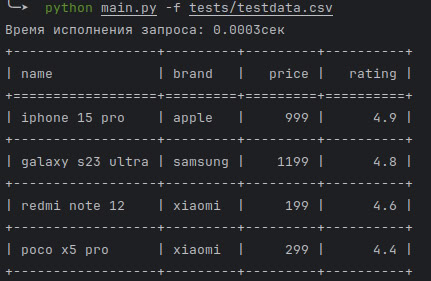
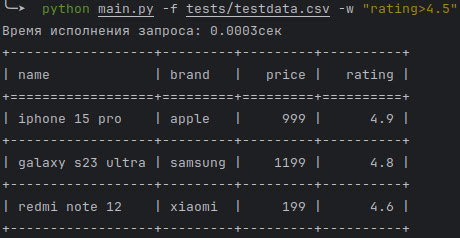
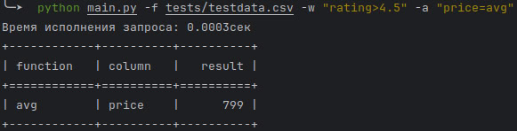
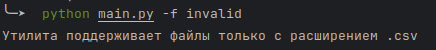
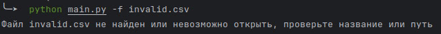
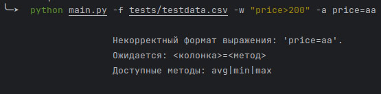
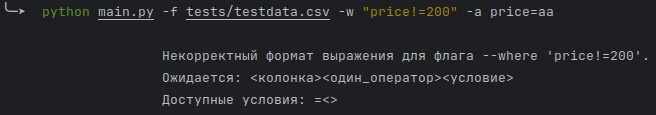

CSV - Handler
---
---

### Содержание:

- [Как использовать?](#title1);
- [Примеры позитивных кейсов](#title2);
- [Примеры негативных кейсов](#title3);
- [Доп. Утилиты](#title4).

---

## Главная функция:

> 🔶 **Прототип обработчика .csv файлов с форматированным выводом через tabulate. Обработчик поддерживает динамическую
валидацию
операторов и агрегационных функций за счет встраивания констант в
регулярные выражения, обеспечивает масштабирование**
---

### 🔹Ограничения: ❌

- Данный output-форматтер загружает все данные в память, не рекомендуется передавать "огромные файлы", чтобы не вызывать
  MemoryError

> Чтобы корректно получить данные с больших файлов, просьба создать экземпляр класса CSVFileHandler и обратится к методу
> .get_full_data() напрямую, вам вернется Generator[Dict[str, Any]]

---

### 🔹<a id="title1">Как использовать?</a>:🧩

Чтобы узнать флаги и их параметры:

```bash
python main.py --help
```

Актуальная на данный момент аннотация утилиты:

```
usage: CSV - Handler  [-h] --file FILE/FILE_PATH [--where COLUMN=CONDITION] [--aggregate COLUMN=OPERATION]

Скрипт по обработки .csv файлов, не поддерживает другие расширения

options:
  -h, --help            show this help message and exit
  --file FILE/FILE_PATH, -f FILE/FILE_PATH
                        В данный флаг нужно передать файл или путь к файлу (Вместе с расширением .csv)
  --where COLUMN=CONDITION, -w COLUMN=CONDITION
                        Фильтрация по: <колонка><один_оператор><условие> Доступные условия: =<>
  --aggregate COLUMN=OPERATION, -a COLUMN=OPERATION
                        Агрегация по: <колонка>=<метод>. Доступные методы: avg|min|max

```

---

### 🔹<a id="title2">Примеры позитивных кейсов</a>:

> Все данные из файла:



> Данные с фильтрацией:



> Данные с агрегацией:


> Данные с фильтрацией и агрегацией:



---

### 🔹<a id="title3">Примеры негативных кейсов</a>:

Основные негативные кейсы:

> Пустой флаг --file/-f


> Файл без расширения .csv



> Ошибка при передаче несуществующего файла или невозможности обработать переданный



> Передача невалидных агрегационных методов



> Передача невалидных параметров фильтрации:



> Попытка применить операторы > или < к строке:


---

### 🔹<a id="title4">Доп. Утилиты</a>:💡

#### Линтер:

```bash
flake8 ./
```

---

#### Типизатор:

```bash
mypy ./
```

---

#### Тесты:

```bash
pytest -v
```

---
